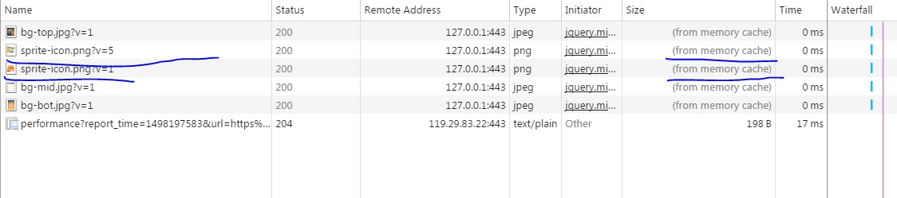

# 重新发版引发的图片缓存问题

> &copy; suny 2017-06-23

### 问题描述

step1: 完成页面第一个版本的发布

step2: 产品要求改设计，页面重新切图

step3: 完成页面第二个版本的发布 -> 发现问题：刷新页面发现图片未更新

step4: 给css中的图片加版本号（雪碧图只对第一个引用加了版本号）

step5: 完成页面第三个版本的发布 -> 发现问题：刷新页面发现雪碧图的其他引用部分未更新，chrome + shift + F5 无效

step6: 给css中对雪碧图的所有引用都加版本号

step7: 完成页面第四个版本的发布 -> 问题解决

step8: 改文案， 发布第n + 1个版本; ...

### 问题分析

1. step3中，忘记给替换的图片加版本号了。

2. step5中，错误的以为新图片加载后会替换缓存中的旧图片，结果并不会，缓存中会同时存在新旧图片。

    

3. step5中, chrome + shift + F5 无效, CDN缓存在作怪

### 问题总结

1. 记得给替换的图片加版本号, 否则CDN缓存强刷都刷不掉。

2. 浏览器中资源的缓存是以url为依据的（不是以文件为依据）。

