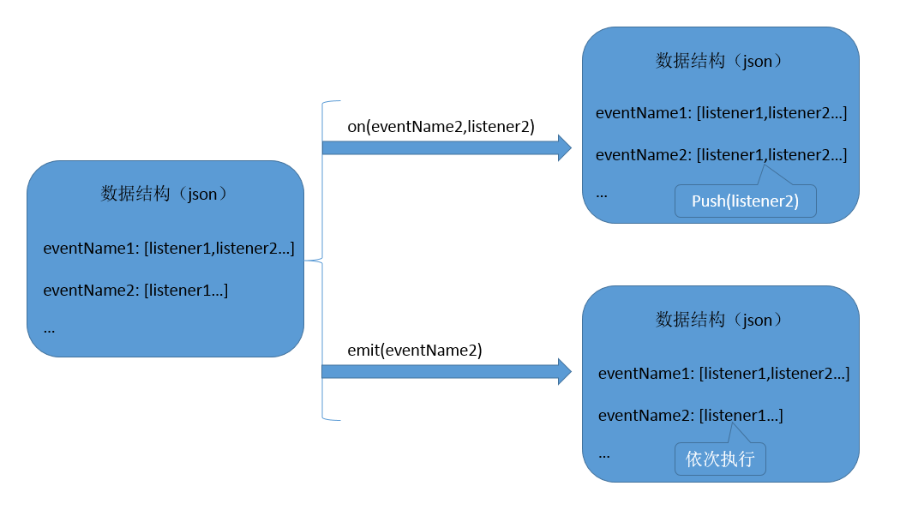
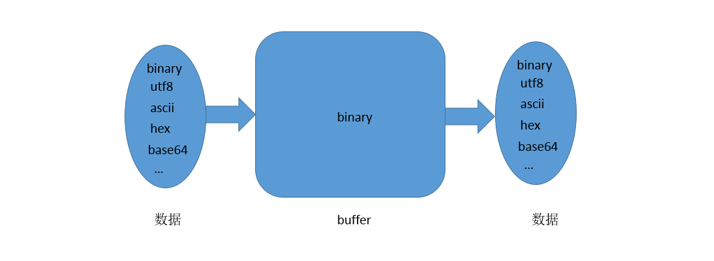
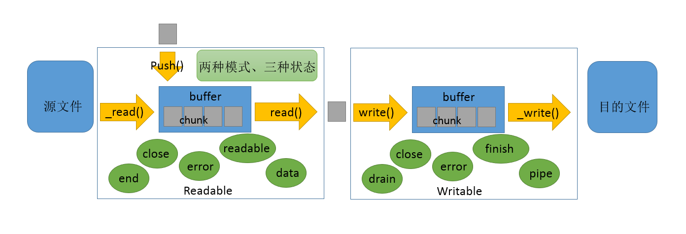
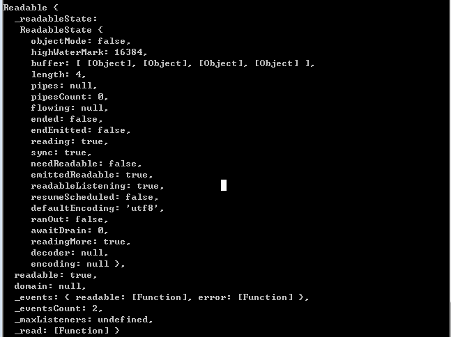
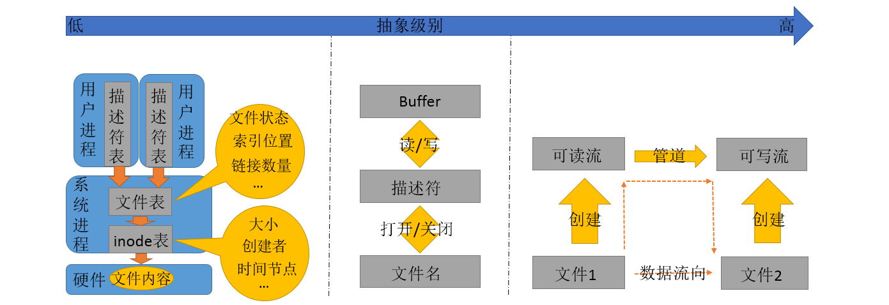
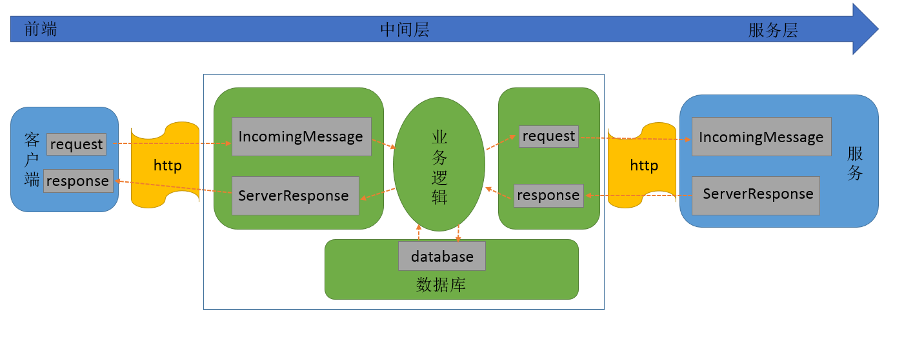

# nodejs核心基础

> &copy; suny 2017-04-19 10:30

### Events 模块

1）理解

　　javascript的核心特性之一是异步，对于jser而言，异步编程有如下几种不同的方式： 回调函数、事件监听、观察者模式、Promise。其中事件监听和观察者模式的使用其实是一样的，触发器触发事件、监听器执行操作。两者的不同之处在于实现，事件监听中的事件是由运行环境（run-time）提供的，何时触发由运行环境决定；观察者模式中的事件类型及其触发时机都是由开发者自定义的。

　　nodejs中的Events模块可以理解为一个实现了观察者模式的库，要在自己的模块中使用，需要显示的引入此模块。此外，Events模块默认实现了一个 `error` 事件来处理模块实例出现异常的情况。

2）API

    EventEmitter类
    监听事件： EventEmitter#on(eventName, listener), EventEmitter#addListener(eventName, listener)
    移除事件监听：EventEmitter#removeListener(eventName, listener)
    触发事件：EventEmitter#emit(eventName, args)

3) 原理

观察者模式数据结构图解

### Buffer 模块

1）理解

　　Buffer类是用于处理二进制数据的，其实例代表一个大小固定、在V8堆外分配的物理内存。buffer对象的使用类似于整型数组，在学习Buffer模块时，暂时不要去考虑其在其他模块（如File System, HTTP）中的应用方式，此处我们只需要知道，Buffer模块是用于 临时存储二进制数据 和 转换用户数据的编码格式 的。

2）API

    Buffer类   将其看作是一个容器
    输入： Buffer.from(), Buffer.alloc(), Buffer.allocUnsafe()
    操作： Buffer.concat(), Buffer.slice(), Buffer.write()
    输出： buf.toString()

3) 原理

缓冲区数据存储与转换图解

### Stream 模块

1）理解

　　流是用于处理I/O操作的的抽象接口。在nodejs中，对于程序中的I/O操作有两种处理方式：第一种是等所有数据接受完毕后一次性从缓存中读取处理；第二种是采取流的方式，收到一小块数据，读取并处理之，然后接着接受下一块小数据，直至处理完所有数据。显然，第一种方式适合处理小文件数据，第二种方式适合处理大文件数据。

　　Stream模块提供了四种类型的流接口：可读流、可写流、可读写流和Transform流。此文重点讨论可读流。

　　可读流的工作过程由 两模式 三状态 管理：两模式为 `flowing` `paused`，其区别体现在是 自动 读取数据还是 手动 读取数据。三状态由 `Readable#_readableState.flowing` 的值确定，当值为 `null` 时，不存在数据消费者，不产生数据；当值为 `true` 时，频繁生成数据且触发事件；当值为 `false` 时，暂停触发事件，数据继续生成。

2）API

    可读流    面向用户
    事件： Readable#on(data | end | error | close | readable)
    管道： Readable#pipe()
    改变流模式： Readable#pause() Readable#resume()

    可写流    面向用户
    事件： Writable#on(drain | finish | pipe | close | error)
    方法： Writable#write() Writable#end()

3) 原理

可读流实例对象结构

流接口

### File System 模块

1）理解

　　文件系统提供了对本地文件进行操作的接口，使开发者具有了对文件的增、删、查、改以及文件内容的读、写的能力。此模块是一系列前端构建工具（如gulp, webpack等）的基础。除了常规的文件操作接口之外，FS模块还封装了一套文件流式操作的接口，大大提高了开发效率。

　　文件是数据持久化最有效的方式之一，一个文件包含的信息为文件元信息和文件内容。其中文件元信息包括文件名、文件权限、文件作者、文件创建时间、文件大小、文件编码格式等一系列对文件进行描述的信息；文件内容为文件的真实储存信息。

2）API

    文件流
    fs.createReadStream(fileName, options)
    fs.createWriteStream(fileName, options)
    常规文件操作
    开关 fs.open(fileName, flags, mode, callback) fs.close(fd, callback)
    读写 fs.read(fd, buffer, offset, length, position, callback) fs.write(fd, data, position, encoding, callback)
    读取元信息 fs.stat(path, callback)
    常规文件夹操作
    增 fs.mkdir(path, mode, callback)
    删 fs.rmdir(path, callback)
    查 fs.readdir(path, options, callback)

3) 原理

文件系统不同抽象级别图解

### HTTP 模块

1）理解

2）API

3) 原理

http web应用整体结构图解

### Errors 模块

### Timers 模块