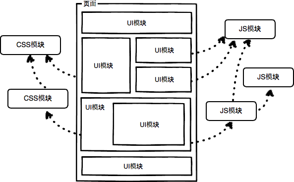

# 每日小结

> &copy; suny


### 2017-04-10


HTML 动态/静态 `NodeList` 和 `HTMLCollection`


**参考文献**

- [querySelectorAll 方法相比 getElementsBy 系列方法有什么区别？](https://www.zhihu.com/question/24702250)


---

### 2017-04-11


DOM事件的 `passive` 属性


**参考文献**

- [addEventListener](https://developer.mozilla.org/zh-CN/docs/Web/API/EventTarget/addEventListener)

---

### 2017-04-13


web接口之 `FileReader` 对象

    有些需求需要将本地的文件导入到页面表单中，因此需要读取本地磁盘中文件的内容， FileReader 接口提供了此权限。

    getFileContent 方法是用 input[type=file] 元素读取文件内容的封装，
    fileInput 参数为 input[type=file] 元素， 
    callback 参数为读取完成后的回调，此回调有一个参数：读取结果字符串。
    
    ```
    function getFileContent(fileInput, callback) {
        if (fileInput.files && fileInput.files.length > 0 && fileInput.files[0].size > 0) {
            var file = fileInput.files[0];
            if (window.FileReader) {
                var reader = new FileReader();
                reader.onloadend = function (evt) {
                    if (evt.target.readyState == FileReader.DONE) {
                        callback(evt.target.result);
                    }
                };
                reader.readAsText(file);
            }
        }
    }
    ```


**参考文献**

- [FileReader](https://developer.mozilla.org/zh-CN/docs/Web/API/FileReader)


---

### 2017-04-14


CSS3 属性 `box-shadow`

```
selector {
    box-shadow: inset <offset-x> <offset-y> <blur-radius> <spread-radius> <color>, ...
}
```


**参考文献**

- [box-shadow](https://developer.mozilla.org/zh-CN/docs/Web/CSS/box-shadow)

---


### 2017-04-17


前端实现0.5px细线

> 背景图片

> css3 缩放

> css3 线性渐变

> css3 阴影

> meta 页面缩放


**参考文献**

- [css3使用技巧：细线边框的3种不同的写法](http://www.daqianduan.com/5935.html)

- [纯CSS实现border的0.5px设置](http://www.zhangyunling.com/543.html)

---


### 2017-04-20


前端上报

> js报错   window.onerror

> 性能   window.prefermance

> 日志

> UI监控


**参考文献**

- [前端相关数据监控](http://www.alloyteam.com/2014/03/front-end-data-monitoring/)

- [如何做前端异常监控？](https://www.zhihu.com/question/29953354)

---


### 2017-04-28


给git仓库配置用户名和邮箱

> 用户名 `git config [--global] [--unset] user.name 'yourname'`

> 邮箱 `git config [--global] [--unset] user.email 'youremail'`


**参考文献**

- [同一客户端下使用多个git账号](http://www.jianshu.com/p/89cb26e5c3e8)

---


### 2017-05-23


through2:转换数据流的封装

```

const through2 = require('through2');
const toUpperCase = through2((dataIn, enc, cb) => {
    let dataOut = new Buffer(data.toString().toUpperCase());
    let error = null;
    cb(error, dataOut);
});
process.stdin.pipe(toUpperCase).pipe(process.stdout);

```

　　through2是nodejs中转换数据流的封装库。上例中 dataIn 是读入数据， dataOut是写出数据，error 是错误信息。


**参考文献**

- [Node.js之对象流（Stream）权威指南](https://futu.im/posts/2017-05-21-object-streams-in-nodejs/)

---


### 2017-05-25


IOS body绑定click事件的bug

> window，document，body 绑定click事件时，点击body不会触发


**参考文献**

- [IOS上给body绑定click事件的bug](http://yanhaijing.com/mobile/2015/08/27/click-bug-on-body-on-ios/)
- [微信内置浏览器不支持 onclick 如何解决？](https://www.zhihu.com/question/37536990)

---


### 2017-05-26


水平、垂直居中的实现

> table时代 `align` `valign`

> css时代 `标准文档流` `浮动布局` `定位布局`

> flex时代 `父容器` `子容器` `主轴` `交叉轴`


**参考文献**

- [一劳永逸的搞定 flex 布局](https://juejin.im/post/58e3a5a0a0bb9f0069fc16bb)
- [CSS Flexible Box Layout](https://developer.mozilla.org/en-US/docs/Web/CSS/CSS_Flexible_Box_Layout)

---


### 2017-05-27


安卓微信浏览器location.href刷新页面失效

　　现象：安卓微信中使用location来刷新当前页面，刷新会失效

　　推测：浏览器缓存了当前页面的url

　　方案：给url加版本号，改变url的值


**参考文献**

- [解决微信内置浏览器location.href和reload刷新失效的问题](http://www.9open.com/article/id/18521.html)


### 2017-05-31


思维导图

> 思维可视化工具


**参考文献**

- [ProcessOn 在线脑图工具](https://www.processon.com/)
- [百度脑图](http://naotu.baidu.com/)

---


### 2017-06-02

关于 `line-height`


> 将line-height的值设为 `1` 是一个很糟糕的实践

> css 难以控制字体度量


**参考文献**

- [深入理解 CSS：字体度量、line-height 和 vertical-align](https://zhuanlan.zhihu.com/p/25808995)
- [FontForge 与字体设计](http://designwithfontforge.com/zh-CN/Introduction.html)

---


### 2017-06-02


使用fiddler进行移动端自测


> `Inspectors` 可以抓包

> `AutoResponder` 可以伪造响应

> `Composer` 可以伪造请求


**参考文献**

- [Fiddler教程](http://www.jianshu.com/p/99b6b4cd273c)
- [使用Fiddler模拟客户端http响应](http://www.cnblogs.com/tangdongchu/p/4178552.html)
- [Fiddler模拟POST请求](http://woyaowenzi.github.io/2015/05/19/Fiddler%E6%A8%A1%E6%8B%9FPOST%E8%AF%B7%E6%B1%82/)

---


### 2017-06-05


ajax封装


> 实现Promise

> 提供abort


**参考文献**

- [xhr/jsonp请求之abort详解](https://futu.im/posts/2017-06-01-xhr-jsonp-abort/)

---


### 2017-06-08


伪元素


> 表示方法

> input标签没有::before和::after伪元素


**参考文献**

- [Can I use the :after pseudo-element on an input field?](https://stackoverflow.com/questions/2587669/can-i-use-the-after-pseudo-element-on-an-input-field)

- [伪元素](https://developer.mozilla.org/zh-CN/docs/Web/CSS/Pseudo-elements)

---


### 2017-06-19


事件理论


> 事件类型

> 事件目标

> 事件处理程序

> 事件对象

> 事件传播


**参考文献**

- [Event事件](http://ghmagical.com/article/page/id/nXCnaSLsuyWd)


---


### 2017-06-20

错误理论


> 错误类型

> 错误捕获

> 错误事件

> 错误调试


**参考文献**

- [JavaScript半知半解-错误处理机制](https://www.kancloud.cn/dennis/tgjavascript/241854)


---


### 2017-06-21

垃圾回收机制


> 引用计数

> 标记清除


**参考文献**

- [JavaScript半知半解-垃圾回收机制](https://www.kancloud.cn/dennis/tgjavascript/241857)


---


### 2017-07-05

做动画时尽量用requestAnimationFrame替代setTimeout


```
var rAF = window.requestAnimationFrame	||
        window.webkitRequestAnimationFrame	||
        window.mozRequestAnimationFrame		||
        window.oRequestAnimationFrame		||
        window.msRequestAnimationFrame		||
        function (callback) { window.setTimeout(callback, 1000 / 60); };
```


---


### 2017-07-10

javascript设计模式


> 外观模式

> 命令模式

> 代理模式

> 中介模式

> 装饰模式

> 观察模式

> 迭代模式

> 适配模式


**参考文献**

- [汤姆大叔的博客](http://www.cnblogs.com/TomXu/archive/2011/12/15/2288411.html)

---


### 2017-07-12

jquery 和 underscore 实现的页面状态切换的封装

```
var $ = require('jquery');
var _ = require('underscore');
/**
 * 路由
 * @constructor
 * @param {string} view 视图容器选择器
 * @reutrn
 * */
module.exports = function UrlLoader(view) {
    var $viewBox = $(view);
    this._views = {};
    this.when = function (status, config) {
        var str = $(config.template).html();
        var templateFn = _.template(str);
        this._views[status] = {
            templateFn: templateFn,
            controllerFn: config.controller,
            deps: config.deps
        };
        return this;
    };
    this.switch = function (status) {
        var self = this;
        var depsArr;
        var compile = function (obj) {
            $viewBox.html(self._views[status]['templateFn'](obj));
            return $viewBox;
        };
        $viewBox.off();
        depsArr = [compile, this].concat(this._views[status]['deps']);
        this._views[status]['controllerFn'].apply(null, depsArr);
    };
    this.init = function (status) {
        this.switch(status);
    };
};
```


用法：

入口js

```
var UrlLoader = require('./roader.js');
var bannerListContainer = require('./bannerListContainer.js');
var bannerItemContainer = require('./bannerItemContainer.js');
var xhr = require('./xhrService.js');
var common = require('./commonService.js');
window.onload = function () {
    var loader = new UrlLoader('#j-views');
    loader.when('bannerList', {
        template: '#bannerList',
        controller: bannerListContainer,
        deps: [xhr, common]
    }).when('bannerItem', {
        template: '#bannerItem',
        controller: bannerItemContainer,
        deps: [common]
    }).init('bannerList');
};
```

bannerList状态逻辑

```
module.exports = function bannerListContainer (compile, loader, xhr, common) {
    var view = compile({});
    view.on('click', '.j-focusad-new', function () {
        loader.switch('bannerItem');
    });
};
```


---


### 2017-07-14

资源、模块、组件概念

> 资源： html,css,js,图片,字体等文件

> 模块

> 组件




**参考文献**

- [关于前端开发中“模块”和“组件”概念的思考](https://github.com/hax/hax.github.com/issues/21)


---


### 2017-07-17

nth-child与nth-of-type

> nth-child(): 如果父元素的第n个子元素符合条件，则命中

> nth-of-type(): 命中父元素的第n个符合条件的子元素


**参考文献**

- [CSS3选择器:nth-child和:nth-of-type之间的差异](http://www.zhangxinxu.com/wordpress/2011/06/css3%E9%80%89%E6%8B%A9%E5%99%A8nth-child%E5%92%8Cnth-of-type%E4%B9%8B%E9%97%B4%E7%9A%84%E5%B7%AE%E5%BC%82/)


### 2017-07-20

层叠等级划分

> 元素的背景和边框形成的层叠上下文

> z-index为负数的层叠上下文

> 正常文档流中，非行内、未定位的元素

> 未定位的浮动元素

> 正常文档流中，未定位的行内元素

> z-index为0的层叠上下文

> z-index为正数的层叠上下文


**参考文献**

- [学习 z-index](https://github.com/YIXUNFE/blog/issues/78)


---


### 2017-07-28


关于js正则表达式


**参考文献**

- [JS正则表达式完整教程](https://juejin.im/post/5965943ff265da6c30653879)


---


### 2017-07-31


js中的异步思维方式 (toobug哥分享)

> callback

> Promise

> Stream

> Rx.js （类似时间序列）


**参考文献**

- [RxJS](http://reactivex.io/rxjs/manual/tutorial.html)


---


### 2017-08-01


css中的百分比

> background-position   相对于容器尺寸减去背景图片尺寸

> width & height   相对于包含块尺寸

> left & right & top & bottom   相对于包含块的尺寸

> margin & padding   相对于包含块的宽度

> border-radius   相对于自身尺寸

> font-size   相对于父元素的font-size

> line-height   相对于元素自身的font-size

> vertical-align   相对于元素自身的line-height

> transform:translate   相对于元素自身的边框尺寸


**参考文献**

- [Positioning Images: the ‘background-position’ property](https://www.w3.org/TR/css3-background/#the-background-position)

- [详述css中的百分比值](http://acgtofe.com/posts/2014/06/percentage-in-css)


---


### 2017-08-02


SQL基础语句

> SELECT 语法：select field1,field2... from table

> DISTINCT 语法：select distinct field from table

> WHERE 语法：select * from table where field operator value

> AND & OR 语法：select * from table where (field1 operation1 value1 or field2 operator2 value2) and field3 operator3 valie3

> Order By 语法：select * from table order by field

> INSERT 语法：insert into table (field1,field2) values (value1,value2)

> UPDATE 语法：update table set field1 = value where field2 = value2

> DELETE 语法：delete from table where field operator value


**参考文献**


- [SQL 语法](http://www.w3school.com.cn/sql/sql_syntax.asp)


---


### 2017-08-07


js中的表达式和语句

> 表达式： 产生一个值，可嵌套

> 语句： 产生一个行为，独立


禁止表达式语句以花括号或关键字的function开头:


```
ExpressionStatement :

[lookahead ∉ {"{", "function"}] Expression ;
```


**参考文献**


- [JS表达式和语句的区别](https://segmentfault.com/q/1010000004102804)

- [表达式 vs 语句](http://clarkdo.github.io/javascript/2015/04/17/56/)


---


### 2017-08-09


nodejs中的路径相关

> 进程路径   process.cwd()

> node.exe路径   process.argv[0]

> 当前执行js文件路径   process.argv[1]

> 当前js模块路径   __dirname + __filename

> 路径处理   path.resolve() + path.relative() + path.join() + path.parse()


**参考文献**

- [http://nodejs.cn/api/](http://nodejs.cn/api/)


---
